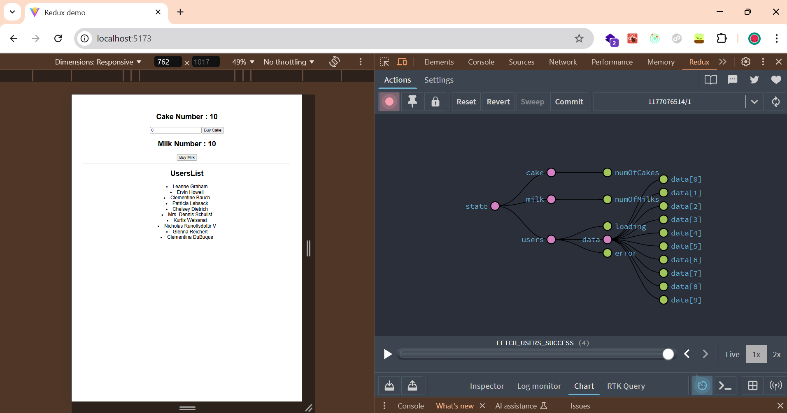

# Redux Demo Project

This project is a demonstration of state management using **Redux** in a React-based application. It showcases the practical implementation of Redux concepts like actions, reducers, and the Redux DevTools.

## Features

- **State Management**:
  - Manage the state of "Cakes" and "Milk" inventory with actions to buy items.
  - Display real-time updates of inventory based on user interactions.

- **User List**:
  - Fetch and display a list of users from a mock API.
  - Handle loading and error states effectively while retrieving user data.

- **Redux DevTools Integration**:
  - Visualize and debug the application's state and actions using Redux DevTools.

## Technologies Used

- **React**: For building the UI.
- **Redux**: For state management.
- **Redux Toolkit**: Simplified Redux setup.
- **Vite**: Fast development environment.

## Preview

## Learning Outcomes

This project helped in understanding:

- Setting up and configuring Redux in a React app.
- Integrating Redux DevTools for debugging.
- Managing asynchronous operations in Redux (e.g., fetching data).
- Visualizing state changes using a graphical chart.
ub.com/vitejs/vite-plugin-react-swc) uses [SWC](https://swc.rs/) for Fast Refresh
